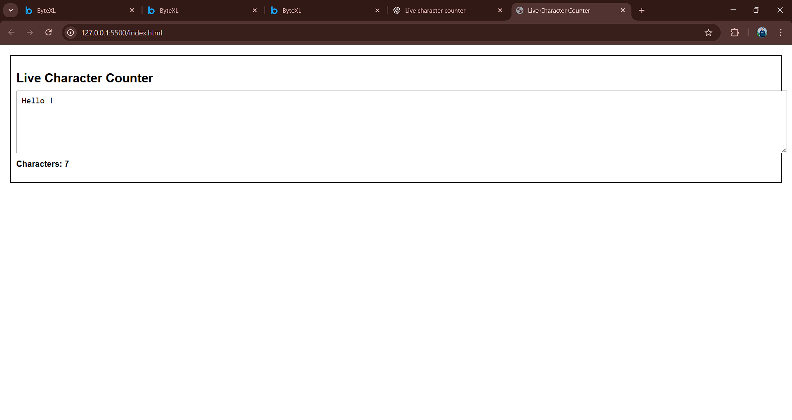

# Live Character Counter

## Overview
The **Live Character Counter** is a simple web-based tool that counts the number of characters entered in a text area in real-time. As the user types or deletes text, the character count updates instantly.

This project is useful for applications like text editors, social media posts, or forms where character limits are enforced.

## Features
- Real-time character counting
- Responsive textarea input
- Clean and minimal design
- Easy to integrate into other web projects

---

## Technologies Used
- HTML5
- CSS3
- JavaScript (Vanilla JS)

---

## How It Works
1. The user types in the `<textarea>` element.
2. A JavaScript `input` event listener detects changes in the textarea.
3. The character count is dynamically updated in a `` element below the textarea.

---

## Usage
1. Clone or download the repository.
2. Open the `index.html` file in your web browser.
3. Start typing in the textarea and watch the character count update live.

## Screenshots

Here is how the Live Character Counter looks:

Made By : Asheem Khan (23BCS13395)